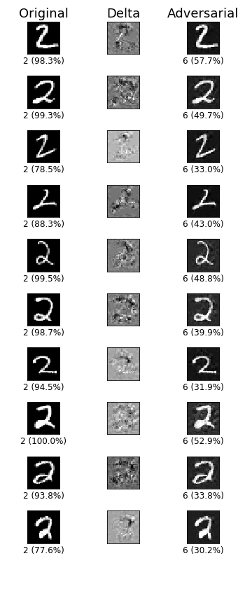

# Creating adversarial images to fool an MNIST classifier

Python 3 implementation of Carlini & Wagner's algorithm (https://arxiv.org/abs/1608.04644).

    
The parameters and variables in Adversarial-Attack.ipynb follow the notation in the paper.

**Distance Metric**   
L2 distance between x and x' is computed ||x - x'||2.

**Objective Function**   
Find delta that solves: min ||delta||2 + c * f(x + delta), such that x+delta is a subset of [0,1]^n.

**Box Constraint**    
delta_i = 1/2 (tanh(w_i)+1) - x_i.
